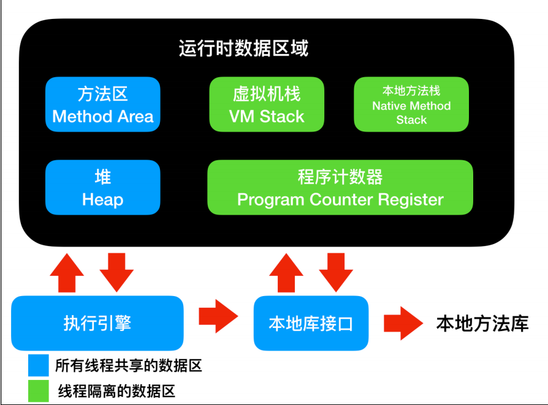
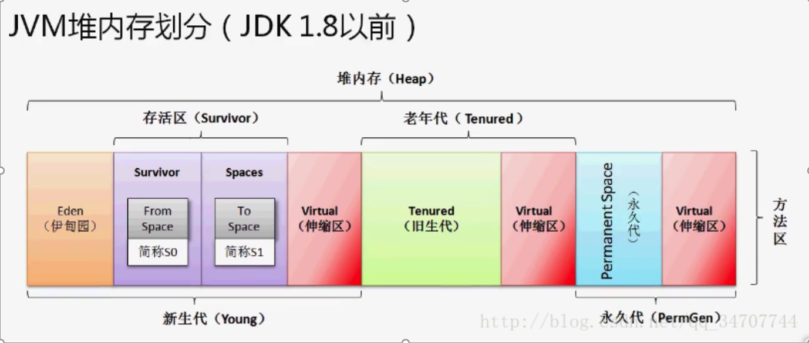
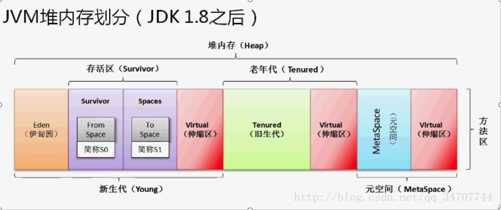
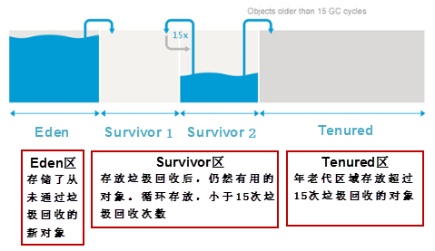

# 虚拟机和垃圾回收

## 虚拟机及其构成

虚拟机指通过软件模拟的具有完整硬件系统功能的、运行在一个完全隔离环境中的完整计算机系统。Java虚拟机对字节码进行解释生成对应平台的机器码并执行。Java虚拟机是Java跨平台的重要原因。

Java虚拟机在执行Java程序的过程中会把它所管理的内存划分为若干个不同的数据区域。

主要包括方法区、堆区、虚拟机栈、本地方法栈、程序计数器，其中方法区和堆区为进程的所有子线程共享，其它的为线程独有。


### 程序计数器

程序计数器是一块较小的内存空间，它的作用可以看作是当前线程所执行的字节码的行号指示器。每个线程都有一个独立的程序计数器，各条线程之间的计数器互不影响，独立存储，是线程私有内存

### Java 虚拟机栈和本地方法栈

本地方法栈和虚拟机栈所发挥的作用是非常相似的，区别是虚拟机栈执行java方法，而本地方法栈则为虚拟机使用的Native方法服务，在sun hotspot中已经把两者合二为一了，本地方法栈区也会抛出StackOverFlowError和OutOfMemeoryError异常

### Java 堆

java堆是垃圾收集器管理的主要区域，因此很多时候也被称为GC堆，Java堆是被所有线程共享的一块内存区域，在虚拟机启动时创建。此区域的唯一目的就是存放对象实例，几乎所有对象的实例都在这分配内存。

### 方法区

方法区和java堆一样，是各个线程共享的内存区域，它用于存储已被虚拟机加载的类信息，常量，静态变量。即时编译器编译后的代码等数据。





### 堆内存分为三部分：

1.年轻代：Young

2.老年代：Tenured

3.永久代 PermGen JDK8中变成元空间MetaSpace

### 年轻代：分为eden区+两个大小相同的存活期s0、s1

所有使用关键字new新实例化的对象，一定会在伊甸园区进行保存(除非大对象，伊甸园区容不下)；存活区会分为两个相等大小的存活区，存活区保存的一定是在伊甸园区保存好久，并且经过了好几次的小GC还保存下来的活跃对象，那么这个对象将晋升到存活区中。

存活区一定会有两块大小相等的空间。目的是一块存活区未来晋升，另外一块存活区为了对象回收。这两块内存空间一定有一块是空的。

在年轻代中使用的是MinorGC（小回收），这种GC采用的是复制算法

### 老年代

主要接收由年轻代发送过来的对象，一般情况下，经过了数次Minor GC 之后还会保存下来的对象才会进入到老年代。每次进行Minor GC 后存活的对象，年龄都会+1，到了一定年龄后（默认15），进入老年代

如果要保存的对象超过了伊甸园区的大小，此对象也将直接保存在老年代之中；

当老年代内存不足时，将引发 “major GC（主回收）”，即，“Full GC（全回收）”。

### 永久代

方法区：是JVM的一种规范，存放类信息、常量、静态变量、即时编译器编译后的代码等；

永久代：是HotSpot的一种具体实现，实际指的就是方法区，

JDK1.8 之后将最初的永久代内存空间取消了，代之以元空间（metaspace）。

为什么废弃永久代:（This is part of the JRockit and Hotspot convergence effort. JRockit customers do not need to configure the permanent generation (since JRockit does not have a permanent generation) and are accustomed to not configuring the permanent generation. 即：移除永久代是为融合HotSpot JVM与 JRockit VM而做出的努力，因为JRockit没有永久代，不需要配置永久代。） 另外由于永久代内存经常不够用或发生内存泄露，爆出异常java.lang.OutOfMemoryError: PermGen

元空间功能和永久代类似，唯一到的区别是：永久代使用的是JVM的堆内存空间，而元空间使用的是物理内存，直接受到本机的物理内存限制。

**注意：**JDK6 及以前版本，字符串常量池是放在堆的Perm区的，Perm区是一个类静态的区域，主要存储一些加载类的信息，常量池，方法片段等，默认大小只有4m，一旦常量池中大量使用 intern 是会直接产生java.lang.OutOfMemoryError:PermGen space错误。

JDK7 的版本中，字符串常量池已经从Perm区移到正常的Java Heap区域了。为什么要移动，Perm 区域太小是一个主要原因;


## 垃圾回收

ava引入了垃圾回收机制(Garbage Collection)，令C++程序员最头疼的内存管理问题迎刃而解。Java程序员可以将更多的精力放到业务逻辑上而不是内存管理工作上，大大的提高了开发效率。

**分代垃圾回收机制**，是基于这样一个事实：不同的对象的生命周期是不一样的。因此，不同生命周期的对象可以采取不同的回收算法，以便提高回收效率。我们将对象分为三种状态：年轻代、年老代、持久代。同时，将处于不同状态的对象放到堆中不同的区域。 JVM将堆内存划分为 Eden、Survivor 和 Tenured/Old 空间。

1. 年轻代：所有新生成的对象首先都是放在Eden区。 年轻代的目标就是尽可能快速的收集掉那些生命周期短的对象，对应的是Minor GC，每次 Minor GC 会清理年轻代的内存，算法采用效率较高的复制算法，频繁的操作，但是会浪费内存空间。当“年轻代”区域存放满对象后，就将对象存放到年老代区域。

2. 年老代：在年轻代中经历了N(默认15)次垃圾回收后仍然存活的对象，就会被放到年老代中。因此，可以认为年老代中存放的都是一些生命周期较长的对象。年老代对象越来越多，我们就需要启动Major GC和Full GC(全量回收)，来一次大扫除，全面清理年轻代区域和年老代区域。

3. 永久代：用于存放静态文件，如Java类、方法等。持久代对垃圾回收没有显著影响。JDK7以前就是“方法区”的一种实现。JDK8以后已经没有“永久代”了，使用metaspace元数据空间和堆替代。



**垃圾回收的相关技能点**

垃圾回收机制主要是回收JVM堆内存里的对象空间。

现在的JVM有多种垃圾回收实现算法，表现各异。

垃圾回收发生具有不可预知性，程序无法精确控制垃圾回收机制执行。

可以将对象的引用变量设置为null，暗示垃圾回收机制可以回收该对象。

程序员可以通过System.gc()或者Runtime.getRuntime().gc()来通知系统进行垃圾回收，会有一些效果，但是系统是否进行垃圾回收依然不确定。

垃圾回收机制回收任何对象之前，总会先调用它的finalize方法（如果覆盖该方法，让一个新的引用变量重新引用该对象，则会重新激活对象）。

永远不要主动调用某个对象的finalize方法，应该交给垃圾回收机制调用。

```java
public class Student {
    @Override
    protected void finalize() throws Throwable {
        System.out.println("-----gc-----------");
    }
    public static void main(String[] args) {
        new Student();
        new Student();
        new Student();
        new Student();
        new Student();
        //System.gc();
        Runtime.getRuntime().gc();
    }
}

```

运行结果：

```
-----gc-----------
-----gc-----------
-----gc-----------
-----gc-----------
-----gc-----------

Process finished with exit code 0

```

这个运行结果每次都会变化，这主要体现了java的垃圾回收机制。